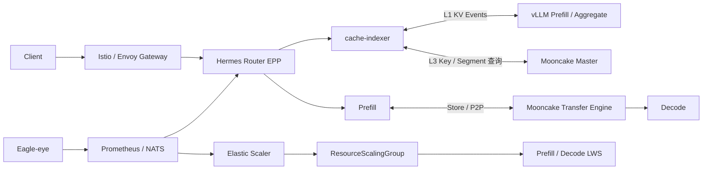
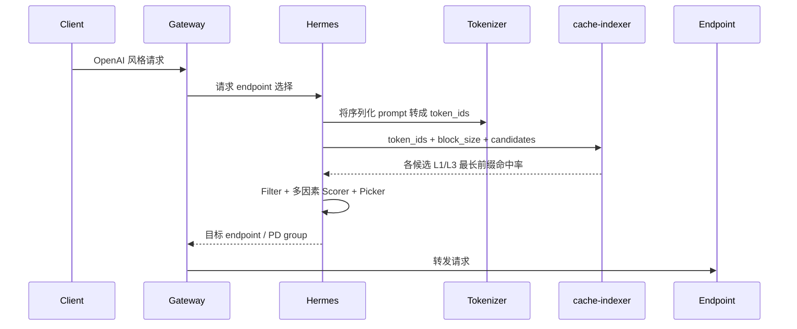

# InferNex KVCache、智能路由与动态上下文技术分析报告

> 文档基线：InferNex / openFuyao v26.06 及当前仓库 `master` 配置  
> 调研日期：2026-08-11  
> 文档目的：整理 InferNex 的 KVCache 性能宣称、Mooncake 层次、Hermes Router、cache-indexer、Eagle-eye、PD-Orchestrator，以及面向多并发 Coding Agent 和动态上下文重建的适用性分析。  
> 证据口径：本文将“仓库与官方文档已确认的能力”和“面向未来的分析建议”分开表达。后者不代表社区已经实现或承诺。

## 1. 执行摘要

### 1.1 一句话结论

InferNex 不是替代 vLLM-Ascend、SGLang 或底层算子系统的推理引擎，而是一套将推理引擎、网关、分布式 KVCache、全局索引、弹性伸缩和可观测能力组合起来的 Kubernetes 推理服务框架。

其当前 KVCache 优化主线是：

1. 使用 vLLM Automatic Prefix Caching 复用完整 KV block。
2. 使用 cache-indexer 汇总多个实例的 L1/L3 KVCache 元数据。
3. 使用 Hermes Router 将请求路由到缓存命中和运行状态更合适的实例。
4. 使用 Mooncake 在 Prefill、Decode 和共享存储之间传输或池化 KV 数据。
5. 使用 Eagle-eye 与 PD-Orchestrator 形成观测、决策、扩缩容控制闭环。

当前实现本质上仍是“精确、连续、从第一个 token 开始的最长前缀复用”。它没有在 InferNex 层实现 KV 稀疏化、低比特 KV 压缩，也没有实现任意中间片段的 KV 拼接、语义级 KV 复用或动态上下文 DAG。

### 1.2 关键判断

| 问题 | 结论 |
|---|---|
| 是否宣称 KVCache 带来数倍吞吐提升 | 没有单独宣称 KVCache 模块带来数倍吞吐；官方给出的是 InferNex 组合优化相对随机路由基线的百分比收益 |
| 主要加速方式 | Prefix caching、KV-aware routing、Mooncake Store/P2P、PD 分离和负载/时延感知调度 |
| 是否进行 KV 稀疏化或压缩 | 当前仓库未发现 KV pruning、稀疏注意力或低比特 KVCache 配置；示例中的 `--quantization ascend` 是模型量化 |
| cache-indexer 是否保存 KV 数据 | 不保存，只维护 block hash、位置和命中率等元数据 |
| 谁决定 block 粒度 | vLLM；InferNex 负责让 indexer、router、Mooncake 和 vLLM 使用一致的 block/hash 参数 |
| Mooncake 的定位 | 分布式 KV 数据面，提供共享 Store 与 Prefill/Decode 间高速传输 |
| Hermes 的定位 | GIE EPP 路由决策组件，按 KV、队列、inflight、资源和预测时延选择 endpoint 或 PD 组 |
| Eagle-eye 与 PD-Orchestrator 关系 | Eagle-eye 提供观测数据，PD-Orchestrator 计算并执行扩缩容；默认配置仍以 CPU 和整组复制为主 |
| 对动态 Coding 上下文是否足够 | 对稳定前缀和追加式会话有效；对重排、摘要更新、分支和上下文重建存在明显限制 |

## 2. 性能宣称与口径

### 2.1 仓库中的公开结果

项目 README 给出两类聚合部署结果：

| 场景 | 基线 | TTFT | TPS |
|---|---|---:|---:|
| 固定 8k 系统提示词复用 | 随机路由 | 平均降低约 54% | 平均提升约 20% |
| 多轮对话 | 随机路由 | 平均降低约 60% | 平均提升约 44% |

来源见 [README-zh.md](../README-zh.md) 的 Performance 章节。

v26.06 完整性能报告进一步拆分了能力组合：

| 规格 | Mooncake Store | KV-aware | Prediction |
|---|---:|---:|---:|
| `agg-base` | 否 | 否，random | 否 |
| `agg-mc` | 是 | 否，random | 否 |
| `agg-mc-kv` | 是 | 是 | 否 |
| `agg-mc-pre` | 是 | 否 | 是 |

在该报告的多轮对话场景中，`agg-mc-kv` 相对 `agg-base` 的 TTFT 平均降低约 65.5%，TPS 平均提升约 56.8%。但这仍是“Mooncake + cache-indexer + Hermes KV-aware + vLLM”组合结果，不能归因成 cache-indexer 或 Mooncake 单模块收益。

官方报告：[InferNex 整体性能测试报告 v26.06](https://gitcode.com/openFuyao/sig-ai-inference/blob/openFuyao-v26.06/reports/performance/InferNex%E6%95%B4%E4%BD%93%E6%80%A7%E8%83%BD%E6%B5%8B%E8%AF%95%E6%8A%A5%E5%91%8A-v26.06.md)

### 2.2 为什么不能简单表述为“TTFT 提速 2.5 倍”

TTFT 降低 60%意味着新 TTFT 是基线的 40%，数学上可以换算为约 `2.5x` 的相对速度。但原始报告采用“降低百分比”，没有将其表述为 KVCache 单项的 2.5 倍加速，而且结果依赖以下条件：

- 请求具有大量可复用前缀。
- 并发、请求长度、模型、硬件和副本数量与测试规格接近。
- Mooncake、prefix caching、cache-indexer 和路由配置正确对齐。
- 缓存命中收益没有被排队、网络传输或热点倾斜抵消。

因此，工程上应保留原始指标口径，不把组合测试扩大解释成普适倍数。

## 3. InferNex 总体架构与 Mooncake 层次



### 3.1 分层职责

| 层次 | 组件 | 核心职责 |
|---|---|---|
| 请求入口 | Istio/Envoy | HTTP 接入、转发、可选重试 |
| 请求决策 | Hermes Router | 选择 endpoint 或 PD 组 |
| KV 元数据 | cache-indexer | 维护 L1/L3 block 位置和最长前缀命中率 |
| 本地缓存 L1 | vLLM | 在 NPU HBM 中管理真实 KV block |
| 分布式缓存 L3 | Mooncake Store | 在分布式内存中保存真实 KV 数据及副本 |
| KV 传输 | Mooncake Transfer Engine | Store 读写、Prefill 到 Decode 的高速传输 |
| 资源决策 | Elastic Scaler / Tidal | 计算期望副本或资源组数量 |
| 资源执行 | RSG / LWS / Kubernetes | 创建、删除和组织 Prefill/Decode 工作负载 |
| 观测 | Eagle-eye | 推理、硬件、网络、Mooncake 和基础设施指标 |

### 3.2 Mooncake 与 InferNex 的关系

Mooncake 不是 InferNex 的控制器，也不负责最终路由。它是 InferNex 集成的 KV 数据面：

- `MooncakeConnectorV1` 用于 Prefill 与 Decode 之间的 KV 直传。
- `AscendStoreConnector` 将 Mooncake Store 作为可跨实例使用的共享 KV 池。
- `MultiConnector` 可以同时组合直传与 Store 能力。
- Mooncake Master 管理 key、replica、segment 等信息。
- Mooncake client/Transfer Engine 管理和搬运真实 KV 数据。
- cache-indexer 轮询 Master 的管理接口，只读取元数据，不经过 KV 数据传输路径。

InferNex 当前默认 PD 配置可以在 [charts/infernex/values.yaml](../charts/infernex/values.yaml) 的 `kvTransferConfig` 中看到上述 Connector 组合。Chart 还会为 Prefill 自动填入 `kv_producer`，为 Decode 填入 `kv_consumer`，聚合实例则为 `kv_both`，实现见 [inference-backend/templates/_helpers.tpl](../charts/infernex/charts/inference-backend/templates/_helpers.tpl)。

cache-indexer 官方将本地 HBM 称为 L1，将 Mooncake 内存缓存称为 L3。当前 L3 索引不覆盖 SSD 层，因为所集成的 Mooncake V1 尚未向 indexer 提供相应查询接口。

## 4. Hermes Router

### 4.1 角色

Hermes Router 是基于 Kubernetes Gateway API Inference Extension 的 EPP，即 Endpoint Picker。它通常不直接承担大模型响应数据面的完整代理，而是根据请求和 endpoint 状态向 Gateway 返回目标实例，实际转发由 Envoy/Istio 完成。

其解决的问题包括：

- 请求应该进入哪个模型实例。
- PD 模式下应该选择哪个 Prefill/Decode 组。
- 缓存命中与排队时间冲突时如何权衡。
- 长请求和短请求是否需要分桶。
- 高负载、硬件饱和或实例故障时是否需要切流和重试。

### 4.2 组成

Hermes 的插件体系分为三层：

1. Data Layer：周期采集或接收外部指标，形成 endpoint 属性。
2. Request Control Layer：执行请求预处理、tokenization、cache-indexer 查询、inflight 记录和预测特征构建。
3. Scheduling Layer：通过 Filter、Scorer、Picker 过滤候选实例、计算多因素得分并选出 endpoint。

当前支持的主要 profile 包括：

| Profile | 适用场景 | 主要依据 |
|---|---|---|
| `random` | 基线、简单均衡 | 随机选择 |
| `kv-cache-aware` | 聚合或 PD | L1/L3 命中、KV 使用率、queue、inflight |
| `bucket` | PD 长短请求混合 | 请求长度、P/D 负载与分桶 |
| `prediction` | 高负载和尾延迟优化 | KV、queue、inflight、NPU 饱和、TTFT/TPOT 预测 |

当前仓库默认启用 `kv-cache-aware`，并将 Prefix、KVUsage、Queue、Inflight 和 P/D 综合权重都设置为 `1.0`，配置见 [charts/infernex/values.yaml](../charts/infernex/values.yaml)。Hermes 官方架构和插件说明见 [hermes-router](https://gitcode.com/openFuyao/hermes-router)。

### 4.3 一次路由决策



需要注意：最高命中率不是必然最优。如果命中实例排队严重，重新计算一个较短前缀可能比等待更快。因此合理目标应是预测端到端成本，而不是只最大化 hit ratio。

## 5. cache-indexer 的粒度、适配和数据重组

### 5.1 它不保存 KV block

cache-indexer 保存的是索引：

```text
block hash -> 存在哪些 vLLM Pod 的 L1 HBM
block key  -> 存在哪些 Mooncake client / segment 的 L3 内存
```

真实 Key/Value 张量仍由 vLLM 和 Mooncake 保存。因此，cache-indexer 不执行 KV Tensor 拼接、拷贝、压缩、反量化或物理内存分配。

### 5.2 block 粒度由 vLLM 决定

假设 block size 为 `B`，vLLM 对完整 token block 使用链式 hash：

```text
h0 = H(cache_salt, tokens[0:B], extra)
h1 = H(h0, tokens[B:2B], extra)
h2 = H(h1, tokens[2B:3B], extra)
```

其中 `extra` 可能包含 LoRA、模态输入或其他区分信息。vLLM 只将完整 block 纳入 prefix cache。由于父 hash 是下一个 block hash 的输入，第 `k` 个 block 或其前置上下文变化后，`k` 及其之后的 hash 都会变化。

官方机制见 [vLLM Automatic Prefix Caching](https://docs.vllm.ai/en/stable/design/prefix_caching/)。

### 5.3 InferNex 如何完成适配

InferNex 不改变 vLLM block 算法，而是对齐所有参与者：

- vLLM 开启 `--enable-prefix-caching`。
- vLLM 开启 `--kv-events-config` 并通过 ZMQ 发布事件。
- vLLM、cache-indexer 使用相同 `block_size`。
- 双方使用相同 `PYTHONHASHSEED`。
- 双方使用相同 `prefixCachingHashAlgo`，当前默认 `sha256_cbor`。
- 双方对 `VLLM_KV_EVENTS_USE_INT_BLOCK_HASHES` 的设置保持一致。

这些参数集中暴露在 [charts/infernex/values.yaml](../charts/infernex/values.yaml) 的 `blockKey`、Prefill/Decode 参数中；vLLM 启动参数由 [prefill-engine-lws.yaml](../charts/infernex/charts/inference-backend/templates/prefill-engine-lws.yaml) 和 [decode-engine-lws.yaml](../charts/infernex/charts/inference-backend/templates/decode-engine-lws.yaml) 渲染。

### 5.4 L1/L3 索引更新

1. cache-indexer 通过 Kubernetes label 发现 vLLM Pod 和 Mooncake Master。
2. 对每个 vLLM Pod 建立 ZMQ SUB，消费 `BlockStored`、`BlockRemoved`、`AllBlocksCleared`，更新 L1 索引。
3. 周期调用 Mooncake Master 的 `/get_all_keys`、`/query_key` 和 `/get_all_segments`，更新 L3 索引。
4. Hermes 向 `/kv-cache/hit-rate` 传入 token IDs、block size、cache salt 和候选 Pod。
5. indexer 复刻 vLLM hash 链，分别返回各候选 endpoint 的 L1/L3 最长连续前缀命中率。

官方实现说明：[AI 推理 KVCache 索引管理](https://gitcode.com/openFuyao/sig-ai-inference/blob/openFuyao-v26.06/docs/zh/ai_inference_cache_indexer/user_guide/ai_inference_cache-indexer.md)

### 5.5 所谓“重组”实际在哪里发生

当前系统没有跨任意片段的 KV 重组。只有两类映射：

- 查询侧：cache-indexer 将请求 token 重新计算为相同的链式 block hash，用于判断是否存在。
- 数据侧：vLLM Connector 根据请求的逻辑 block/hash 和本地 block table，将 Mooncake 中的 KV 数据装载到目标实例的物理 KV slot。

Mooncake Store Connector 使用共享池和 hash key 查找 KV，Prefill/Decode 直传则由 Connector 和 Transfer Engine 完成。详见 [vLLM Mooncake Store Connector](https://docs.vllm.ai/en/latest/api/vllm/distributed/kv_transfer/kv_connector/v1/mooncake/store/connector/)。

## 6. KV 稀疏化、压缩与量化边界

当前仓库未发现以下 InferNex 原生能力：

- KV token pruning 或稀疏选择。
- 稀疏注意力驱动的 KV 丢弃。
- FP8、INT8、INT4 KVCache 存储配置。
- KV 张量压缩、解压和误差控制模块。
- 基于重要度的 layer/head/token 级缓存保留。

示例中的 `--quantization ascend` 指模型权重量化，不等于 KVCache 量化。InferNex 的 `extraArgs` 可以向 vLLM 透传引擎支持的参数，但由此启用的 KV 量化仍属于目标 vLLM/vLLM-Ascend 版本能力，不是 InferNex 自身算法。

README roadmap 提到未来 KVCacheX 将探索 DSA、Hybrid Attention KV offloading 等方向，但 roadmap 不应当作当前已实现能力。[README-zh.md](../README-zh.md)

## 7. Eagle-eye 与 PD-Orchestrator

### 7.1 Eagle-eye

Eagle-eye 是观测和诊断体系，主要由以下部分组成：

- Prometheus：周期抓取指标，适合趋势、告警和扩缩容计算。
- NATS：低延迟发布订阅，面向对新鲜度要求较高的路由和诊断场景。
- hardware-monitor：通过 DCMI/NVML、系统日志等采集温度、功耗和错误码。
- hardware-diagnosis：订阅硬件数据，执行阈值和故障模式识别。
- network-performance-exporter：采集 RDMA/RoCE 速率、剩余带宽、链路和丢包等指标。

它提供数据，不直接创建或删除 Prefill/Decode 实例。官方说明见 [Eagle-eye 用户指南](https://gitcode.com/openFuyao/sig-ai-inference/blob/openFuyao-v26.06/docs/en/ai_inference_eagle_eye/user_guide/eagle_eye_for_ai_inference.md)。

### 7.2 PD-Orchestrator

PD-Orchestrator 包含三个控制器：

| 组件 | 职责 |
|---|---|
| Elastic Scaler | 根据指标或事件计算期望副本/组数，支持默认 APA 和自定义算法 |
| ResourceScalingGroup | 对多个关联工作负载执行成组复制或组内伸缩 |
| Tidal | 根据时间规则计算潮汐期望副本，实际执行仍交给扩缩容链路 |

当前 InferNex 默认配置为：

- `minReplicas: 1`，`maxReplicas: 10`。
- `scalingAlgorithm: apa`。
- 默认触发指标为 CPU 利用率，目标 70%。
- RSG 管理 Prefill 和 Decode 两个 LeaderWorkerSet。
- 默认策略是 `GroupReplication`，即 P/D 整组扩缩。
- 缩容示例按 `vllm:num_requests_running` 两分钟平均值排序。

对应配置见 [charts/infernex/values.yaml](../charts/infernex/values.yaml)。官方控制器关系说明见 [InferNex 用户指南](https://gitcode.com/openFuyao/sig-ai-inference/blob/main/docs/zh/ai_inference_infernex/user_guide/ai_inference_infernex.md)。

### 7.3 二者的闭环与当前限制

```text
Exporter / vLLM / Mooncake
        -> Prometheus / NATS
        -> Hermes 路由或 Elastic Scaler 决策
        -> RSG 修改 P/D LWS
        -> Kubernetes 创建或删除 Pod
        -> Hermes 和 cache-indexer重新发现实例
```

Eagle-eye 和 PD-Orchestrator 是松耦合关系。组件被同时部署，不表示所有 Eagle 指标都会自动进入扩缩算法。当前默认值仍是 CPU 驱动和整组复制，尚未默认实现基于 TTFT、TPOT、KV 热度、网络成本和 P/D 独立队列的最优比例控制。

## 8. 命中与非命中场景

合理路由目标不是单独最大化命中率，而是最小化预计端到端成本：

```text
T(i, d) =
    queue_wait(i)
  + l3_fetch(i)
  + uncached_prefill(i)
  + pd_transfer(i, d)
  + decode_queue(d)
  + predicted_generation(d)
```

### 8.1 L1 命中

- KV 已在目标实例 HBM 中，复用成本最低。
- 只需要对未命中的尾部 token 做 Prefill。
- 若该实例已经形成热点并严重排队，命中收益可能小于等待成本。
- Hermes 应在命中率、queue、inflight、KV 使用率之间权衡。

### 8.2 L3 命中

- KV 位于 Mooncake 内存层，需要网络读取并装载到本地 HBM。
- 是否复用取决于传输时间与重新计算时间的比较。
- 对很短的命中前缀，重新 Prefill 可能更快。
- 对长上下文和昂贵 Prefill，L3 复用通常更有价值。

### 8.3 完全非命中

- 应优先选择队列短、Prefill 吞吐高、资源未饱和的实例。
- 完成 Prefill 后生成新 KV，并按配置写入 Mooncake。
- vLLM 异步发布新的 KV Event，cache-indexer更新全局视图。
- PD 模式还需要把请求 KV 交给对应 Decode 实例。

### 8.4 索引过期或假命中

KV event、服务发现和 L3 轮询都存在传播延迟。路由时的 indexer 结果只能作为提示，vLLM/Mooncake 才是最终数据真相。工程上必须允许：

- 索引显示命中但 KV 已淘汰时回退到 Prefill。
- Pod 重启或缩容后及时清理 endpoint 索引。
- 防止多个请求因同一热门前缀同时涌向单实例。
- 对 cache-indexer 不可用设置超时和非 KV 路由回退策略。

## 9. 多并发 Coding Agent 与持续增长上下文

### 9.1 当前架构擅长的情况

Coding Agent 请求通常包含以下内容：

```text
System Prompt
+ 工具定义
+ 仓库/项目说明
+ 历史对话
+ 新工具输出
+ 当前用户问题
```

如果前部内容稳定、历史主要按尾部追加，那么：

- 多个会话可以共享 System Prompt 和工具定义。
- 同一会话可复用上一轮的大部分历史。
- 固定仓库说明或固定代码快照可形成较长公共前缀。
- cache-indexer 可以帮助后续请求继续落到保存该前缀的实例。

这与官方固定系统提示词、多轮对话测试高度一致。

### 9.2 当前架构容易失效的情况

以下操作会从首次变化的 block 开始破坏后续 hash 链：

- 重新排列检索到的文件和代码片段。
- 更新放在上下文前部的摘要或长期记忆。
- 删除、压缩或改写旧工具输出。
- Agent 创建分支、回滚或切换任务。
- Chat template、tokenizer、模型版本或 cache salt 变化。
- 语义相同但文本序列化不同。

对于 Transformer，某个 token 的 KV 还依赖其前置上下文和位置编码。因此，一个语义相同的代码片段移动到不同位置后，通常不能直接复用原 KV。语义相似度可以帮助选择上下文，但不能直接证明 KV 数值兼容。

### 9.3 高并发下的热点问题

大量 Coding 请求共享同一 System Prompt 或代码仓库前缀时，简单“最高命中率优先”会产生缓存热点：

- 同一实例获得越来越多请求。
- queue 和 inflight 增长，TTFT 反而恶化。
- 其他实例虽然空闲，但没有热门前缀。
- 扩出的新实例是冷缓存，短期内不能立即分担热点。

因此需要综合比较：

```text
命中节省的 Prefill 时间
- L3 传输成本
- 当前排队时间
- 热点放大风险
- 新实例预热成本
- 未来请求对该缓存的预计复用价值
```

Hermes `prediction` profile 是向这个目标迈出的一步，但当前官方报告指出预测模型主要依赖离线训练，NPU 指标存在约 3 至 5 秒延迟，而且 v26.06 性能报告尚未补充 PD 分离场景测试。因此其对复杂 Coding 工作负载的效果仍需单独验证。

## 10. 面向自演进动态上下文重建的演进建议

本节属于架构建议，不代表当前 InferNex 已实现。

### 10.1 建立上下文版本 DAG

为每次上下文构建增加：

```text
context_id
parent_context_id
branch_id
segment_hashes
token_spans
model/tokenizer/template revision
cache_salt / adapter / multimodal metadata
```

路由器不只看到一串 token，还能知道它从哪个上下文版本演进而来。这样可以按“最长共同祖先”选择缓存，而不是只依赖全局匿名前缀。

### 10.2 规范化上下文布局

将上下文按稳定性排序：

```text
稳定 System / Tool Schema
-> 稳定仓库索引与约束
-> 会话 checkpoint
-> 本轮检索代码和工具结果
-> 最新用户请求
```

尽量保持稳定内容和位置不变，将易变数据放到尾部。这不会突破 Transformer 的因果约束，但能显著延后首次 hash 分叉点。

### 10.3 增量重建而非任意拼接

对新旧上下文计算最长共同前缀：

- 共同完整 block 直接复用。
- 首个变化 block 及之后重新 Prefill。
- 对追加式上下文创建周期 checkpoint。
- 对分支会话保留多个热祖先，而不是覆盖单一会话状态。

任意中间片段 KV 拼接通常不具备正确性保证。若希望实现真正的非前缀 KV 组合，需要模型结构、位置编码、attention 或专用 cache blending 算法配合，不能只修改 cache-indexer。

### 10.4 将命中率升级为“可复用计算价值”

cache-indexer/Hermes 可以进一步维护：

- 命中 token 数和命中层级。
- L1/L3 实际读取耗时。
- 每个模型、长度和硬件上的 Prefill 成本曲线。
- 缓存最近访问、访问频率和预计未来复用次数。
- 缓存唯一副本数、迁移成本和失效风险。

路由目标应从 `max(hit_ratio)` 演进为 `min(predicted_total_latency)` 或 `max(saved_compute_per_cost)`。

### 10.5 会话亲和与受控迁移

- 对活跃 Coding 会话保持弱粘性，优先延续其 KV lineage。
- 粘性不是硬绑定，实例拥塞或故障时允许切换。
- 切换前比较 Mooncake 迁移、L3 装载和重新 Prefill 成本。
- 扩容时预热热门公共前缀，避免新实例长期冷启动。
- 缩容时优先删除低热度、低唯一缓存价值且无运行请求的组。

### 10.6 语义缓存与 KV 缓存分层

语义能力应放在上下文构建层：

- 检索相关文件、符号、diff 和摘要。
- 决定哪些片段进入 prompt。
- 规范化排序和文本序列化。
- 判断是否可以使用历史回答或工具结果。

KV 层继续使用精确 hash 和模型配置校验。不能因为两个上下文语义相近，就直接复用彼此的 KV Tensor。

### 10.7 在线反馈闭环

Eagle-eye、Hermes 和 PD-Orchestrator 可以形成更完整的闭环：

```text
实际 TTFT / TPOT / queue / hit / network
-> 在线特征与预测误差
-> 更新路由模型和扩缩策略
-> 影子评估
-> 小流量启用
-> 自动回退和版本化
```

这类在线学习必须具备模型版本、特征版本、漂移监测、影子模式和确定性 fallback，避免路由策略本身成为生产不稳定因素。

## 11. 为什么 InferNex 要包含这些“加速相关模块”

推理引擎只掌握单进程或单实例内部状态，而以下问题天然跨越多个系统：

- Gateway 必须在请求进入引擎前选择 endpoint。
- cache-indexer 必须汇总多个 Pod 和 Mooncake 的缓存位置。
- Mooncake 必须处理跨节点 KV 数据移动。
- PD-Orchestrator 必须操作 Kubernetes 工作负载和副本关系。
- Eagle-eye 必须从引擎、硬件、网络和存储收集指标。

因此合理分层是：

| 层 | 典型技术 |
|---|---|
| 模型与算子执行 | vLLM-Ascend、SGLang、Triton/Ascend 算子工具链 |
| 单实例调度与本地 KV | vLLM/SGLang engine |
| 分布式 KV 数据面 | Mooncake、Connector |
| 集群请求与资源控制 | Hermes、cache-indexer、PD-Orchestrator、Eagle-eye |
| 集成交付与生命周期 | InferNex Helm、InferNex-Bridge、KServe/Kubernetes |

InferNex 的价值不是重复实现 attention kernel，而是让局部引擎能力在多实例云环境中形成可部署、可观测、可扩缩和可回退的服务。对应代价是组件版本耦合、配置一致性要求和跨层排障复杂度更高。

## 12. 当前成熟度判断

| 能力 | 当前判断 |
|---|---|
| 聚合模式固定前缀复用 | 已有配置与性能数据支持 |
| 聚合模式多轮对话 | 已有性能数据支持 |
| L1/L3 全局命中率查询 | 已实现并有官方接口说明 |
| PD KV 直传与 Store 组合 | 已有 Chart 配置与 Connector 集成 |
| KV-aware 多因素路由 | 已实现，默认启用 |
| Prediction 路由 | 已实现但受离线模型和指标新鲜度限制 |
| PD 弹性整组扩缩 | 已实现，默认 CPU/APA/GroupReplication |
| 基于 KV 热度的缩容保护 | 当前默认配置未体现 |
| KV 稀疏化/压缩 | 当前 InferNex 未实现 |
| 任意片段 KV 重组 | 当前未实现，且受模型因果语义约束 |
| Coding Agent 上下文 DAG | 当前未实现 |
| 在线自演进路由与上下文重建 | 属于后续架构方向 |

## 13. 建议的验证方案

若要判断 InferNex 是否适合真实 Coding Agent，建议不要只复用官方固定前缀测试，而应建立以下矩阵：

| 维度 | 建议取值 |
|---|---|
| 会话形态 | 严格追加、摘要更新、文件重排、分支、回滚 |
| 并发 | 1、8、32、128，区分独立会话与共享仓库 |
| 缓存层级 | 无缓存、L1、L3、L1+L3 |
| 路由 | random、KV-aware、prediction、理想离线 oracle |
| 上下文长度 | 8k、32k、64k、模型上限 |
| 指标 | TTFT、TPOT、E2E、TPS、P50/P99、实际命中 token、L3 传输字节、重算 token |
| 弹性 | 冷扩容、热扩容、缩容、Pod 重启、Mooncake 淘汰 |

特别需要记录“命中率高但端到端更慢”的反例，因为它能直接检验路由是否真正优化总成本，而不是只追求缓存指标。

## 14. 最终结论

InferNex 当前最有价值的能力，是把 vLLM 的局部 prefix cache 扩展为集群可感知、可路由、可传输、可伸缩的资源。Mooncake、cache-indexer、Hermes、Eagle-eye 和 PD-Orchestrator 分别负责数据、索引、决策、观测和执行，分工总体合理。

但它的缓存语义仍建立在 vLLM 精确 block hash 和最长连续前缀之上。对于固定系统提示词、共享工具定义和追加式多轮对话，这条路线有效；对于会不断重排、摘要、分支和自我重建上下文的 Coding Agent，仅靠 prefix cache 不足以达到全局最优。

未来真正需要补齐的是“上下文版本关系 + 预测总成本路由 + 缓存价值感知弹性 + 严格 KV 正确性边界”。语义级上下文选择和精确 KV 复用应当分层设计：上层负责决定使用什么上下文，下层只复用经过 hash、位置和模型配置验证的 KV 数据。

## 15. 主要参考资料

- [InferNex README](../README-zh.md)
- [InferNex 默认 values](../charts/infernex/values.yaml)
- [InferNex inference-backend values](../charts/infernex/charts/inference-backend/values.yaml)
- [InferNex Bridge 技术规格](../component/InferNex-Bridge/docs/InferNex-Bridge-Technical-Specification.md)
- [InferNex 用户指南](https://gitcode.com/openFuyao/sig-ai-inference/blob/main/docs/zh/ai_inference_infernex/user_guide/ai_inference_infernex.md)
- [InferNex 整体性能测试报告 v26.06](https://gitcode.com/openFuyao/sig-ai-inference/blob/openFuyao-v26.06/reports/performance/InferNex%E6%95%B4%E4%BD%93%E6%80%A7%E8%83%BD%E6%B5%8B%E8%AF%95%E6%8A%A5%E5%91%8A-v26.06.md)
- [Hermes Router](https://gitcode.com/openFuyao/hermes-router)
- [cache-indexer 用户指南](https://gitcode.com/openFuyao/sig-ai-inference/blob/openFuyao-v26.06/docs/zh/ai_inference_cache_indexer/user_guide/ai_inference_cache-indexer.md)
- [Eagle-eye 用户指南](https://gitcode.com/openFuyao/sig-ai-inference/blob/openFuyao-v26.06/docs/en/ai_inference_eagle_eye/user_guide/eagle_eye_for_ai_inference.md)
- [vLLM Automatic Prefix Caching](https://docs.vllm.ai/en/stable/design/prefix_caching/)
- [vLLM KV Events](https://docs.vllm.ai/en/v0.9.0/api/vllm/distributed/kv_events.html)
- [vLLM Mooncake Store Connector](https://docs.vllm.ai/en/latest/api/vllm/distributed/kv_transfer/kv_connector/v1/mooncake/store/connector/)
