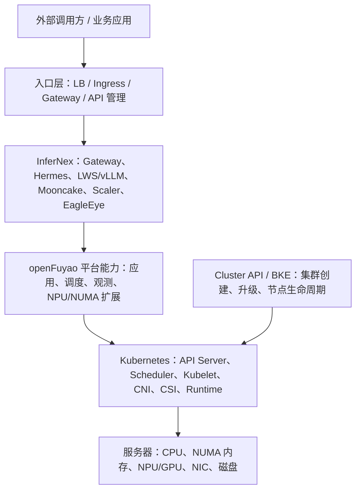
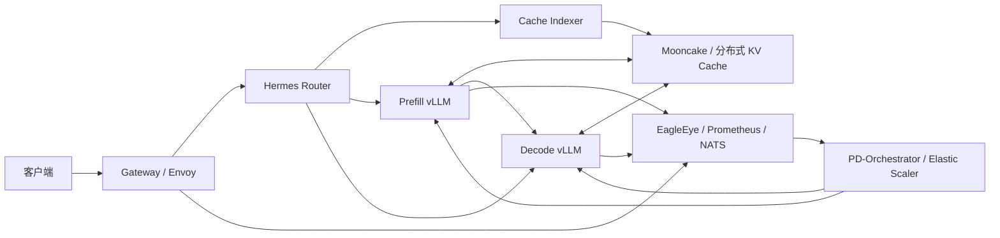
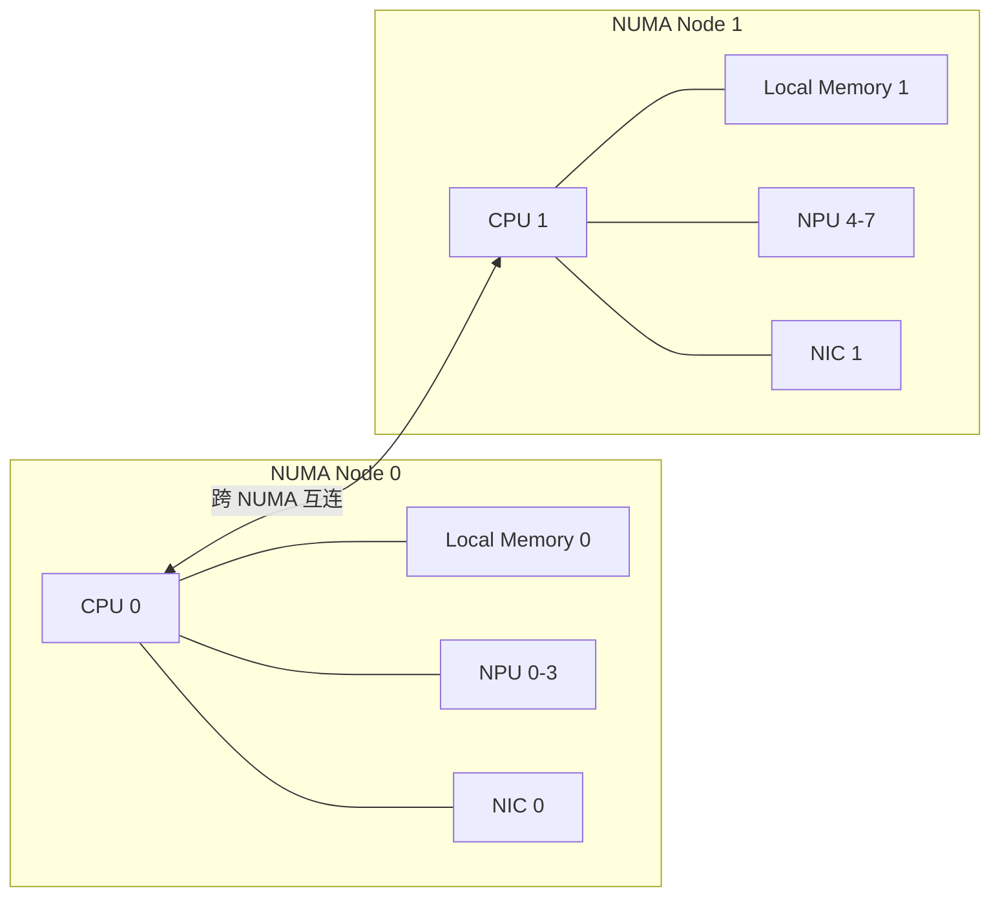

# openFuyao 与 InferNex 技术洞察报告

> 文档基线：openFuyao / InferNex v26.06；调研日期：2026-08-10  
> 文档目的：解释二者的起源、定位、设计、架构、功能边界、部署关系、NUMA 价值与后续演进，并为实际建设提供判断依据。  
> 证据口径：本文将“官方事实”“仓库实现证据”和“分析判断”分开表达。标记为“判断”或“推演”的内容，不代表社区正式承诺。

## 1. 执行摘要

### 1.1 一句话结论

**openFuyao 是面向通算和智算集群的云原生基础平台与组件生态；InferNex 是该生态内面向大模型推理场景的端到端集成方案。**前者负责把机器建设、管理成可运行工作负载的 Kubernetes/openFuyao 集群，后者负责在这个集群上组织网关、智能路由、推理引擎、KV Cache、弹性伸缩和可观测性。

两者不是平级替代关系，也不能简单理解成“安装 openFuyao 就一定安装了 InferNex”。更准确的关系是：

| 维度 | openFuyao / Cluster API | InferNex |
|---|---|---|
| 核心对象 | 机器、节点、集群、基础组件 | 模型服务、推理实例、请求、KV Cache、SLO |
| 主要职责 | 集群创建、扩缩、升级、基础资源治理 | 模型部署、请求路由、PD 编排、缓存、推理弹性与观测 |
| 生命周期 | 基础设施生命周期 | AI 业务应用生命周期 |
| 交付方式 | BKE/Cluster API、核心版本配置、平台组件 | Helm Chart，或 InferNex-Bridge CRD |
| 对外接口 | Kubernetes API、平台管理接口 | OpenAI 风格模型 API，例如 `/v1/chat/completions` |
| 是否互相包含 | 可把 InferNex列入生态/发行组件目录 | 依赖已就绪的 Kubernetes 及 NPU 等基础能力 |

### 1.2 关于“Cluster API 部署是否包含 InferNex”

结论是：**从产品生态和版本发布目录看，InferNex 属于 openFuyao；从实际安装动作和运行态看，Cluster API 部署不等于已经部署 InferNex。**

本次检查 v26.06 的 `Core-VersionConfig-v26.06.yaml`，其中包含 `cluster-api-provider-bke`，但没有 `InferNex`、`infernex`、`NUMA` 或 `npu-operator` 条目。这说明执行：

```bash
bke build -f Core-VersionConfig-v26.06.yaml -t bke.tar.gz
```

构建的是 openFuyao 核心集群离线交付物，而不是 InferNex 的完整离线运行包。InferNex 仍需单独准备 Helm Chart、镜像、模型、NPU 驱动/CANN 兼容环境及其前置组件。

### 1.3 最重要的工程洞察

1. **“被发行版列出”不等于“已装入集群”。**版本兼容清单是生态/BOM 范围，运行态必须通过 Helm Release、CRD、Deployment、Service 和 Pod 验证。
2. **Cluster API 与 InferNex是上下层关系。**Cluster API 解决“集群如何得到并持续可管理”，InferNex 解决“模型推理如何高效运行”。
3. **InferNex 的核心价值不只是安装 vLLM。**它建立了“请求路由 - KV 状态 - PD 资源 - SLO 指标 - 弹性控制”的闭环。
4. **NUMA 是性能局部性机制，不是服务暴露机制。**它影响 CPU、内存、NPU、NIC 之间的数据路径，但不会让 ClusterIP 自动变成外部可访问地址。
5. **生产化最大的风险来自版本耦合和运维复杂度。**Kubernetes、LWS、Gateway API、Istio/Envoy、vLLM、Mooncake、Cache Indexer、CANN/驱动之间需要一份严格兼容 BOM。

## 2. 起源与演进

### 2.1 openFuyao 的起源

openFuyao 的官方定位是“通算、智算集群开源社区”，希望构建多样性算力集群的软件生态，打通不同计算资源的连接、调度和算力释放。其首个社区版本 v25.03 于 2025 年发布，架构思想是“核心平台 + 插件化组件”：

- 核心平台提供集群、应用、资源、可观测和权限等通用能力。
- NUMA 感知调度、NPU Operator、推理套件等能力以扩展组件加入。
- 底座基于 Kubernetes，但目标不是简单重新打包 Kubernetes，而是补充异构算力治理和智算业务所需能力。

因此，openFuyao 的起点是“算力基础设施平台”，其问题域比单个推理框架大得多。

### 2.2 InferNex 的起源

InferNex 来源于 openFuyao AI Inference SIG 对大模型推理问题的工程化整合。该 SIG 关注的根本矛盾包括：

- 大模型推理存在 TTFT、TPOT、排队和队头阻塞等时延问题。
- KV Cache 随上下文增长，占用大量显存和内存，并具有请求状态属性。
- 异构加速卡成本高，传统 Kubernetes 调度器不了解 KV、动态批处理、Prefill/Decode 等推理语义。
- 单独部署推理引擎不能自动解决跨实例路由、缓存复用、SLO 弹性和故障恢复。

早期 openFuyao 存在 AI 推理套件及 `aiaio-installer` 安装路径。官方用户指南说明，从 v26.03 起相关能力合并进入 InferNex，并迁移到统一 Helm Chart。之后的主要演进包括：

| 版本 | 主要演进 |
|---|---|
| v26.03 | PD-Orchestrator、故障转移和后端重构；原 AI 推理套件能力并入 InferNex |
| v26.05 | 引入 InferNex-Bridge，支持 KServe `LLMInferenceService` 和 `InferNexService` 声明式部署 |
| v26.06 | 后端转向 LWS，支持多 DP、APA 弹性、时延预测、L3 KV 感知、观测增强和部署前检查 |

### 2.3 二者共同的设计脉络

二者共同遵循“稳定基础面 + 可替换专业组件”的思路：

- openFuyao 把 Kubernetes 和集群治理作为基础面，把智算能力作为扩展。
- InferNex 把 Gateway API Inference Extension 等标准资源作为接口面，把 Hermes、vLLM、Mooncake 等作为可组合实现。

这解释了为什么 InferNex 既是 openFuyao 的组成项目，又仍然需要独立安装和独立版本管理。

## 3. 目标与非目标

### 3.1 openFuyao 的目标

- 统一管理通算与智算资源，降低异构硬件接入和运维成本。
- 提供集群生命周期、应用管理、资源调度、可观测与安全治理。
- 通过插件体系容纳 NPU、NUMA、混部、推理、大数据等场景能力。
- 建立面向多样性算力的软件接口、标准与生态。

openFuyao **不是**单一模型服务，也不是仅面向某一个推理引擎的发行包。

### 3.2 InferNex 的目标

- 用一套可复现的 Helm/CRD 工作流部署大模型推理服务。
- 支持聚合式和 Prefill/Decode 分离式推理。
- 使用请求、缓存、负载和时延信息做智能路由。
- 建立本地 HBM 与分布式 KV Cache 的统一查询和复用能力。
- 基于业务 SLO 与硬件指标进行伸缩、预热和故障处理。
- 为网关、推理引擎、芯片和缓存实现保留替换空间。

InferNex **不是**裸机集群安装器，也不负责完整的企业用户体系。官方指南明确提示其模型 API 没有内建完整鉴权、审计能力，生产部署应由上游 API Gateway 或平台补齐。

## 4. 总体架构与边界

### 4.1 分层关系



这里存在两个容易混淆的“控制面”：

| 控制面 | 管理对象 | 典型接口 |
|---|---|---|
| Kubernetes/openFuyao 集群控制面 | Node、Pod、Service、CRD、集群状态 | Kubernetes API Server |
| InferNex 推理控制面 | 模型实例、路由策略、PD 组、KV 索引、伸缩决策 | Gateway API/GIE、LWS、InferNex/KServe CRD |

控制面 API 通常通过管理网络、负载均衡 VIP、堡垒机、VPN 或 kubeconfig 访问；模型数据面则通过 Gateway/LoadBalancer/NodePort/Ingress 暴露。二者不应共用无保护的公网入口。

### 4.2 Cluster API 部署流程

openFuyao 的 Cluster API 安装文档把部署分为引导集群、管理/业务集群和后续组件安装，其关注点是：


Cluster API 通过声明式资源管理 Kubernetes 集群的机器和控制面生命周期。它能为 InferNex 提供一致的集群底座，但不会因为业务集群 Ready 就自动出现模型、推理 Pod 或模型 API。

### 4.3 InferNex 内部架构



这套架构可拆成四个面：

| 架构面 | 组件 | 职责 |
|---|---|---|
| 接入与路由面 | Gateway、Envoy、Hermes Router | 接收 OpenAI 风格请求，按负载、KV、PD 组和预测时延选实例 |
| 推理数据面 | LWS、vLLM/xPyD、Prefill/Decode 实例 | 模型加载、批处理、Prefill、Decode 和 Token 输出 |
| 状态与缓存面 | Cache Indexer、Mooncake | 维护 L1/L3 KV 位置视图，传输和复用 KV Cache |
| 观测与控制面 | EagleEye、Prometheus、NATS、PD-Orchestrator、Scaler | 采集业务/系统/硬件指标，并调整实例或 PD 资源组 |

## 5. 核心功能组成

### 5.1 Helm 总装包

仓库中的 `charts/infernex/Chart.yaml` 表明 InferNex 是一个聚合 Chart，依赖：

- `inference-gateway-crds`
- `inference-gateway`
- `inference-backend`
- `hermes-router`
- `cache-indexer`
- `eagle-eye`
- `pd-orchestrator`

这进一步证明 InferNex 是“集成和版本锚点”，不是所有代码都集中在一个进程中。其价值在于给出一套已验证的组合、默认值和部署顺序。

### 5.2 Gateway 与 Hermes Router

Gateway 负责外部协议终止和流量入口，Hermes 则理解推理语义。官方能力说明包括：

- KV Cache 感知路由。
- Prefill/Decode 分桶或分组路由。
- 负载、时延预测和计算饱和度感知。
- 故障转移与重试。
- 对 GIE/Envoy 类网关协议的适配。

普通 Kubernetes Service 只解决四层服务发现和负载转发，通常不知道某个请求的 Prompt KV 是否已经存在于某个实例。因此，Hermes 不是简单重复 Service，而是在其上增加“推理状态感知”。

### 5.3 LWS 与推理后端

LeaderWorkerSet（LWS）用于表达多 Pod 协同工作的分布式推理单元。InferNex v26.06 以 LWS 组织聚合式或 PD 分离式 vLLM 工作负载，适合模型并行、多 DP 以及需要确定组关系的场景。

后端可配置模型、镜像、vLLM 参数、芯片资源和 Pod 资源。仓库默认模型只是示例配置，实际是否存在可调用模型仍要查看当前 Helm values、LWS/Deployment 和运行中 Pod，不能仅根据 Chart 已安装来判断。

### 5.4 Cache Indexer 与 Mooncake

Cache Indexer 保存 KV Cache 的逻辑索引，Mooncake 提供分布式存储/传输能力。OFEP-0053 展示了 Cache Indexer 的重构方向：

- 用 Go 重构索引服务。
- 区分 L1 本地 HBM 和 L2/L3 分布式缓存来源。
- 从推理引擎的 ZMQ 事件和 Mooncake 接口收集缓存位置。
- 提供查询接口给路由器，而不是把具体缓存实现耦合进 Hermes。

这是一项关键设计：**路由决策需要缓存的“目录”，但不应承担缓存数据本身的存储和搬运。**目录面与数据面分离后，Hermes、Mooncake 和推理引擎可以分别演进。

代价是组件必须共享一致的 Tokenizer、Block Hash 和协议版本，否则“看似命中”的缓存可能无法复用，甚至产生错误。因此缓存协议是 InferNex BOM 中最敏感的兼容边界之一。

### 5.5 PD-Orchestrator 与弹性

PD 分离把 Prompt Prefill 的计算密集阶段和逐 Token Decode 的访存/时延敏感阶段拆开。PD-Orchestrator 负责管理资源组、伸缩和状态协调。它的目标不是只看 CPU 百分比扩容，而是结合：

- 请求队列和到达率。
- TTFT、TPOT 等服务指标。
- Prefill 与 Decode 的容量比例。
- 实例启动、模型加载和 KV 预热成本。
- NPU、网络和缓存状态。

这使弹性成为有状态、带预热成本的控制问题，不能直接套用无状态 Web 服务的 HPA 经验。

### 5.6 EagleEye 与可观测性

EagleEye 汇集业务、系统、网络与硬件指标，并为路由和伸缩提供反馈。可观测数据不只是展示面板，也是控制回路输入。因此生产环境应重视指标延迟、缺失、时间同步和错误值；错误指标可能导致错误扩缩或流量震荡。

### 5.7 InferNex-Bridge

InferNex-Bridge 提供 CRD/控制器适配，让用户通过 KServe `LLMInferenceService` 或 `InferNexService` 声明模型服务。它与主 Helm Chart 的区别是：

- 主 Chart 更像一次性安装一套具体推理栈及默认实例。
- Bridge 更像持续运行的控制器，根据 CR 声明创建和维护模型服务。

Bridge 代表 InferNex 从“集成安装包”向“平台化模型服务控制面”演进，但它仍部署在已有 Kubernetes 集群上，不能替代 Cluster API。

## 6. 部署包、运行态与 API 可见性

### 6.1 三个容易混淆的层次

| 层次 | 能说明什么 | 不能说明什么 |
|---|---|---|
| 离线包中存在制品 | Chart/镜像已被下载 | 组件已安装或已运行 |
| Helm Release/CR 已创建 | Kubernetes 中已有期望状态 | Pod 一定健康、模型一定加载成功 |
| Gateway/Service 有外部地址 | 网络入口已建立 | API 鉴权、模型名和推理链路一定正确 |

应按以下顺序检查实际集群：

```bash
# 1. 找 InferNex Helm Release
helm list -A | grep -i infernex

# 2. 找相关 CRD 和模型资源
kubectl get crd | grep -Ei 'infernex|llminference|inference|gateway|leaderworkerset'
kubectl get llminferenceservice,infernexservice -A 2>/dev/null

# 3. 找工作负载和镜像
kubectl get deploy,sts,lws,pod -A -o wide | grep -Ei 'infernex|vllm|hermes|mooncake|cache|eagle|prefill|decode'

# 4. 找服务入口
kubectl get gateway,httproute,svc,ingress -A -o wide

# 5. 不知道模型服务名时，从 Pod 镜像和启动参数反查
kubectl get pod -A -o jsonpath='{range .items[*]}{.metadata.namespace}{"\t"}{.metadata.name}{"\t"}{range .spec.containers[*]}{.image}{" "}{.args}{"\n"}{end}{end}' \
  | grep -Ei 'vllm|model|served-model-name|prefill|decode'
```

### 6.2 为什么 Kubernetes 服务在外部“看不见”

Kubernetes Service 有不同可见范围：

| 类型 | 默认可见范围 | 用途 |
|---|---|---|
| `ClusterIP` | 集群 Pod 网络内部 | 服务间调用 |
| `NodePort` | 节点 IP + 固定端口 | 测试或作为外部 LB 后端 |
| `LoadBalancer` | 由云/MetalLB 等提供外部地址 | 生产入口 |
| `ExternalName` | DNS 映射，不提供代理 | 引用集群外服务 |

InferNex 默认 values 中 Gateway NodePort 为 `30088`，但是否可从外部访问还取决于节点路由、防火墙、安全组和 Gateway 实际状态。生产环境通常在它前面配置 LoadBalancer、Ingress/API Gateway 或专用 VIP，并补齐 TLS、鉴权、限流和审计。

可用以下命令验证模型 API：

```bash
kubectl get svc -A -o wide | grep -Ei 'gateway|envoy|inference|hermes'
kubectl get gateway,httproute -A

# 临时测试：绕过外部网络问题
kubectl -n <namespace> port-forward svc/<gateway-service> 8080:<service-port>

curl http://127.0.0.1:8080/v1/models
curl http://127.0.0.1:8080/v1/chat/completions \
  -H 'Content-Type: application/json' \
  -d '{"model":"<served-model-name>","messages":[{"role":"user","content":"hello"}]}'
```

`/v1/models` 是否可用取决于当前网关和后端配置；最可靠的模型名来源仍是 `served-model-name` 参数、Helm values 或对应 CR 的 spec。

## 7. NUMA：是什么，在 InferNex 中做什么

### 7.1 NUMA 的含义

NUMA（Non-Uniform Memory Access，非一致内存访问）常见于多路 CPU 服务器。每颗 CPU Socket 与一部分内存组成 NUMA Node：

- CPU 访问本 NUMA Node 的内存更快、带宽更高。
- 访问另一 NUMA Node 的内存需要经过 CPU 互连，时延更高并占用互连带宽。
- PCIe 设备，如 NPU、GPU、NIC，也通常更靠近某个 NUMA Node。



如果推理 Pod 使用 NPU 0，却把 CPU 线程、锁页内存或网络中断放到 NUMA Node 1，主机到设备拷贝、通信线程、Tokenizer 和缓存搬运都可能产生跨 NUMA 流量。

### 7.2 NUMA 在这里的作用

NUMA 优化主要服务于以下链路：

- vLLM/xPyD 的 CPU 工作线程与 NPU 本地化。
- Host Memory、Pinned Memory 与 NPU DMA 路径本地化。
- Mooncake/KV 传输线程、NPU 与高速 NIC 本地化。
- 多卡通信时减少不必要的 Socket 间流量。
- 为低时延推理减少抖动，提高吞吐稳定性。

它不负责：

- 创建模型服务。
- 暴露 Service 到公网。
- 选择模型名。
- 替代路由、KV Cache 或弹性组件。

### 7.3 NUMA 生效需要三层协同

| 层次 | 机制 | 作用 |
|---|---|---|
| 集群调度层 | Volcano/openFuyao NUMA-aware scheduling | 选择具有合适 NUMA 拓扑和剩余资源的节点 |
| Kubelet 节点层 | Topology Manager + CPU Manager + Memory Manager + Device Manager | 在节点内协调 CPU、内存与设备的拓扑提示和分配 |
| 运行时层 | vLLM/通信库线程绑核、`CPU_AFFINITY_CONF` 等 | 把进程线程实际约束到分配的 CPU 集合 |

只做其中一层通常不够。例如：

- 只设置 Pod `affinity`，表达的是节点/Pod 亲和性，不等于 NUMA 亲和性。
- 只设置 `CPU_AFFINITY_CONF=1`，运行时会尝试绑核，但 Kubernetes 可能没有给出拓扑一致的 CPU、内存和 NPU。
- 只启用 Topology Manager，若 Pod 不是 Guaranteed QoS 且 CPU 请求不是整数核，CPU Manager `static` 策略通常不能为其分配独占 CPU。

仓库默认 `charts/infernex/values.yaml` 中某些容器 CPU request 与 limit 不相等，通常形成 Burstable QoS；而 GLM 示例中 CPU/内存 request 与 limit 相等，并设置了 `CPU_AFFINITY_CONF=1`，更接近性能部署所需条件。最终仍应检查完整 Pod 中所有容器，因为 QoS 是按整个 Pod 判定。

### 7.4 推荐的 NUMA 验证方法

```bash
# 查看节点 NUMA 和设备拓扑
lscpu -e=CPU,NODE,SOCKET,CORE
numactl --hardware
lspci -tv

# 查看 kubelet 策略
cat /var/lib/kubelet/config.yaml | grep -E 'topologyManager|cpuManager|memoryManager' -A3

# 查看 Pod QoS、CPU 与设备资源
kubectl get pod <pod> -n <namespace> -o jsonpath='{.status.qosClass}{"\n"}'
kubectl describe pod <pod> -n <namespace>

# 进入容器检查实际 CPU 集合
kubectl exec -n <namespace> <pod> -- sh -c 'grep Cpus_allowed_list /proc/self/status'
```

应用 NUMA 策略前后应对比 TTFT、TPOT、吞吐、P95/P99、CPU 跨 Node 内存访问、PCIe/NIC 吞吐和 NPU 利用率，而不是只确认配置项存在。

官方较早的 NUMA 文档曾提示 NUMA 组件和 NPU Operator 可能因 Volcano 版本产生冲突。该提示具有版本条件，不能直接外推到 v26.06；部署时应以同版本兼容矩阵和实际 Chart 依赖为准。

## 8. 架构优势、代价与风险

### 8.1 架构优势

| 优势 | 价值 |
|---|---|
| 标准化北向接口 | 采用 Kubernetes、Gateway API/GIE、KServe CRD，降低平台接入成本 |
| 模块化组件 | 网关、路由、后端、缓存、观测可分别演进和替换 |
| 推理状态感知 | 路由不再只看连接数，而能利用 KV、PD、负载和时延信息 |
| 闭环弹性 | 业务 SLO、系统指标与资源控制关联起来 |
| 多级缓存 | 减少重复 Prefill，提高长上下文和共享 Prompt 场景效率 |
| 异构扩展方向 | 保留多芯片、多引擎和高速通信适配空间 |

### 8.2 主要代价

- 组件数量多，故障定位跨越网关、路由、索引、缓存、引擎和硬件。
- 控制回路存在滞后，伸缩、预热和请求波动可能形成震荡。
- PD 分离增加网络传输和资源配比问题，不保证所有模型与负载都受益。
- KV Cache 复用依赖 Tokenizer、Block Hash、模型版本和缓存协议一致。
- 首次模型加载与 NPU 初始化时间长，传统分钟级弹性未必满足突发请求。
- InferNex 默认不构成完整企业 API 管理面，必须外接身份、租户、配额和审计。

### 8.3 风险矩阵

| 风险 | 表现 | 建议 |
|---|---|---|
| 版本漂移 | Pod 能启动但路由/缓存协议不兼容 | 固化 v26.06 全量 BOM、镜像 digest 和 Chart 版本 |
| 离线包缺件 | 集群装好但 InferNex 镜像或模型不在内网 | 核心包、InferNex 包、模型包分层验收并生成清单 |
| API 暴露不完整 | ClusterIP 正常但外部不能访问 | 设计 LB/VIP、DNS、TLS、鉴权、防火墙完整路径 |
| NUMA 假生效 | 配了 affinity 但性能无改善 | 验证 QoS、cpuset、设备/NIC 拓扑并做 A/B 压测 |
| 缓存一致性 | 命中率异常或无法复用 | 锁定 Tokenizer/Block Hash，监控索引事件丢失和版本 |
| 弹性滞后 | 扩容后仍超时，缩容导致抖动 | 加入预测、预热、冷却时间和最小容量保护 |
| 可观测失真 | 指标延迟触发错误路由/扩缩 | 监控遥测链路自身，设置缺失数据降级策略 |
| 控制面暴露 | kube-apiserver 或管理入口被公网攻击 | 管理网隔离、最小 RBAC、堡垒机/VPN、证书轮换 |

## 9. 后续扩展与演进判断

### 9.1 官方路线中已经明确的方向

根据 AI Inference SIG 路线，后续工作集中在：

- Hermes Router：更多 GIE/Envoy 兼容能力和多因素感知策略。
- KVCacheX/Mooncake：高可用、统一寻址、共享内存和高性能传输。
- Cache Indexer：物理位置感知、分层缓存和高效批处理查询。
- PD-Orchestrator：SLO 驱动弹性、迁移、预热和动态资源组。
- EagleEye：更接近实时的业务、系统、网络和硬件观测。
- OFIXL-Connector：面向硬件无关的高性能内存语义通信。
- LLM-IF-Deployer/Bridge：一键部署与声明式模型服务管理。

### 9.2 基于现有架构的推演

以下是分析判断，不是社区已承诺特性：

1. **从单集群向多集群推理调度扩展。**openFuyao 已有集群生命周期能力，InferNex 已有请求和缓存状态，二者结合后具备区域/集群级路由基础，但要解决模型分发、跨集群 KV 成本和一致性。
2. **从 Helm 实例化转向 CRD 平台化。**Bridge 会逐步承担多模型、多租户持续调谐，Helm 更适合安装控制器和共享基础组件。
3. **从被动指标弹性转向预测弹性。**模型加载太慢，只有请求到达后才扩容往往来不及，未来更依赖流量预测、镜像/权重预热和热备容量。
4. **从“支持某硬件”转向拓扑/链路自动优化。**调度器可能综合 NUMA、NPU、NIC、交换网络和缓存位置，不再只按卡数匹配。
5. **供应链与离线交付会成为产品能力。**企业智算环境常为隔离网络，未来需要可验证的多架构镜像、SBOM、签名、漏洞扫描、模型清单和增量升级机制。

## 10. 建设建议

### 10.1 交付边界

建议把离线交付拆成四层，并分别验收：

| 包 | 内容 | 架构要求 |
|---|---|---|
| openFuyao 核心包 | BKE、Cluster API、Kubernetes 基础镜像和核心组件 | 必须匹配控制面/节点 CPU 架构 |
| 智算基础包 | NPU Operator、驱动/CANN 依赖、LWS、Volcano/NUMA 组件 | 匹配 CPU 架构、NPU 型号和内核/驱动版本 |
| InferNex 组件包 | Helm Chart、Hermes、vLLM、Mooncake、Indexer、Scaler、EagleEye | 容器镜像平台必须覆盖目标节点架构 |
| 模型与配置包 | 权重、Tokenizer、量化配置、服务参数 | 匹配模型、推理引擎、量化格式和可用 NPU 内存 |

离线包确实需要与目标节点 CPU 架构一致。更精确地说，所有在该节点执行的二进制和镜像 manifest 都应包含目标平台，例如 `linux/amd64` 或 `linux/arm64`；模型权重通常不因 CPU 指令集变化，但其加载器、算子库和量化格式仍有兼容要求。

### 10.2 生命周期与版本治理

- 将 openFuyao 集群版本和 InferNex 应用版本作为两个发布列车管理。
- 建立包括 K8s、LWS、Gateway API、Istio/Envoy、NPU Operator、驱动/CANN、vLLM、Mooncake、Hermes、Indexer 的 BOM。
- 记录所有镜像 digest，离线导入后做哈希验收。
- 升级先在一组节点和一类模型上验证路由、KV、PD 与 NUMA，再滚动到生产。

### 10.3 生产入口

- 模型 API 通过专用 Gateway/LB 暴露，不直接公开 kube-apiserver。
- 加入 TLS、认证、租户配额、限流、审计和内容策略。
- 控制面通过管理网、VPN 或堡垒机访问，并实施最小 RBAC。
- 对 `/v1/chat/completions` 做端到端探测，不能只探测 Service 端口。

### 10.4 性能验证

- 分别测试聚合式和 PD 分离式，按真实 Prompt/Output 长度分布决定架构。
- 对 KV 命中与不命中、短上下文与长上下文分别压测。
- 对 NUMA 策略进行 A/B 测试，观察 P95/P99，而不只看平均吞吐。
- 同时采集 NPU、CPU、内存带宽、NIC、KV 命中率、TTFT 和 TPOT，避免局部指标误导。

## 11. 最终判断

openFuyao 与 InferNex 的关系可以概括为：**生态与场景方案、基础设施控制面与推理业务控制面、集群生命周期与模型服务生命周期。**

Cluster API 部署解决的是“得到一个可管理的 openFuyao/Kubernetes 集群”；InferNex 部署解决的是“在这个集群里得到一套可调用、可路由、可缓存、可伸缩、可观测的模型推理服务”。前者为后者提供土壤，但不会天然包含后者的运行实例。

InferNex 的长期价值不在于把若干 Chart 打成一个包，而在于把 Kubernetes 原本不了解的 LLM 状态引入调度和控制闭环：请求属于哪个模型、KV 在哪里、Prefill 和 Decode 哪边拥塞、扩容何时能真正提供容量、硬件拓扑是否让数据走了正确路径。NUMA 则是这个闭环下方的节点级性能基础，它决定 CPU、内存、NPU 和网络能否保持局部性，但必须与调度、Kubelet 策略和运行时绑核共同工作。

对实际项目而言，最稳妥的建设方式是：**用 openFuyao/BKE 管好集群，用独立、可追踪的 InferNex BOM 管好推理栈，用 Gateway 管好外部 API，用拓扑验证和业务压测决定 NUMA/PD/KV 优化是否真正生效。**

## 12. 参考资料与源码证据

### 12.1 官方资料

1. [openFuyao 官方主页](https://www.openfuyao.cn/zh/)
2. [openFuyao 首版本特性：核心平台与插件化组件](https://www.openfuyao.cn/zh/blogs/blogsList/openfuyao-features/)
3. [openFuyao Cluster API 安装流程](https://docs.openfuyao.cn/en/docs/v26.03/installation_guide/installation_process.html)
4. [管理面部署业务集群](https://docs.openfuyao.cn/docs/Cluster_API_Installation/Service_Cluster_Installation_on_the_Management_Plane/)
5. [openFuyao 版本兼容说明](https://docs.openfuyao.cn/en/docs/v26.03/release_notes/version_compatibility_notes.html)
6. [openFuyao v26.06 版本概览](https://gitcode.com/openFuyao/docs/blob/openFuyao-v26.06/docs/en/release_notes/version_overview.md)
7. [AI Inference SIG：目标、项目与路线](https://gitcode.com/openFuyao/sig-ai-inference)
8. [InferNex 官方用户指南](https://gitcode.com/openFuyao/sig-ai-inference/blob/main/docs/zh/ai_inference_infernex/user_guide/ai_inference_infernex.md)
9. [InferNex 官方仓库](https://gitcode.com/openFuyao/InferNex)
10. [OFEP-0053：Cache Indexer 重构增强](https://gitcode.com/openFuyao/ofep/blob/main/ofeps/sig-ai-inference/0053-ofep-cache-indexer%E9%87%8D%E6%9E%84%E5%A2%9E%E5%BC%BA.md)
11. [openFuyao NUMA-aware Scheduling](https://docs.openfuyao.cn/docs/User_Guide/Computing_Power_Optimization_Center/NUMA_aware_Scheduling/)
12. [Kubernetes Topology Manager](https://kubernetes.io/docs/tasks/administer-cluster/topology-manager/)
13. [Kubernetes CPU Manager](https://kubernetes.io/docs/tasks/administer-cluster/cpu-management-policies/)

### 12.2 本仓库证据

- [`README-zh.md`](../README-zh.md)：项目定位、版本演进、组件、依赖、安装方式和路线。
- [`charts/infernex/Chart.yaml`](../charts/infernex/Chart.yaml)：聚合 Chart 及组件依赖。
- [`charts/infernex/values.yaml`](../charts/infernex/values.yaml)：Gateway、模型、资源、路由和后端默认配置。
- [`component/InferNex-Bridge/README-zh.md`](../component/InferNex-Bridge/README-zh.md)：Bridge、KServe 和 InferNex CRD 部署方式。
- [`examples/GLM-5.2-w8a8-vLLM-aggregated-random.yaml`](../examples/GLM-5.2-w8a8-vLLM-aggregated-random.yaml)：聚合式推理、资源和 CPU 亲和配置示例。
- [`examples/GLM-5.1-w4a8-vLLM-pd-random.yaml`](../examples/GLM-5.1-w4a8-vLLM-pd-random.yaml)：PD 分离、资源和 CPU 亲和配置示例。
- [`infernex-checker`](../infernex-checker/)：部署前环境检查实现。

